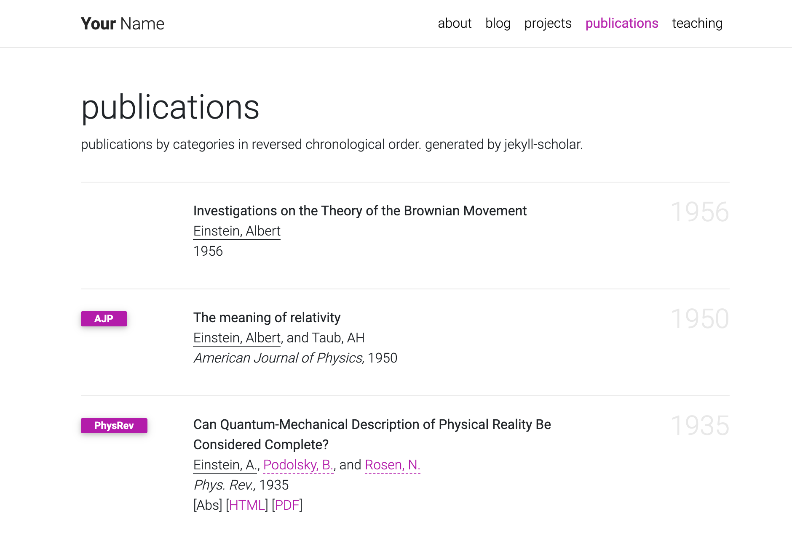
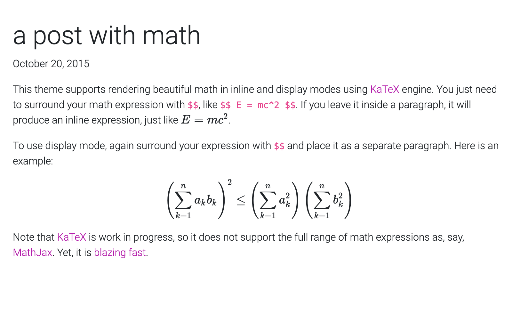
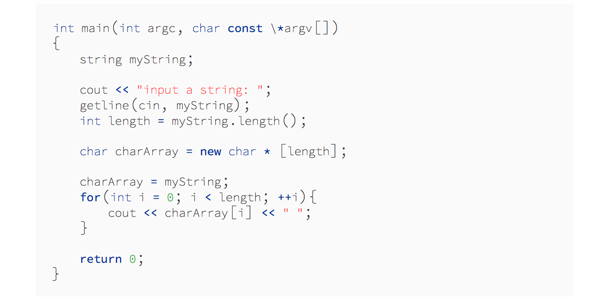
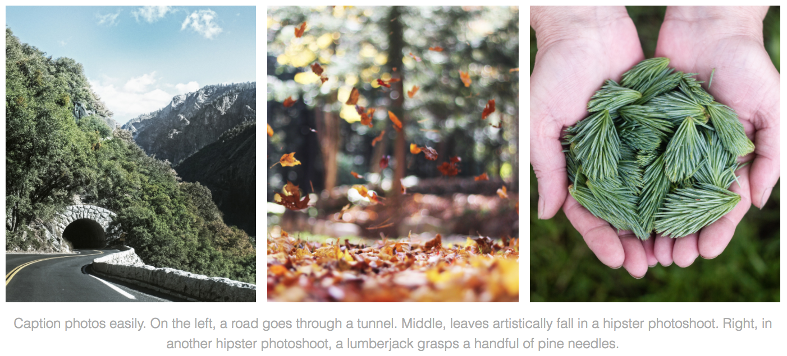

# al-folio

[](https://travis-ci.org/alshedivat/al-folio)
[](https://alshedivat.github.io/al-folio/)
[](https://gitter.im/alshedivat/al-folio?utm_source=badge&utm_medium=badge&utm_campaign=pr-badge)

[](https://github.com/alshedivat/al-folio)
[](https://github.com/alshedivat/al-folio/fork)

A simple, clean, and responsive [Jekyll](https://jekyllrb.com/) theme for academics.
If you like the theme, give it a star!

[](https://alshedivat.github.io/al-folio/)


## Getting started

For more about how to use Jekyll, check out [this tutorial](https://www.taniarascia.com/make-a-static-website-with-jekyll/).
Why Jekyll? Read this [blog post](https://karpathy.github.io/2014/07/01/switching-to-jekyll/)!


### Installation

Assuming you have [Ruby](https://www.ruby-lang.org/en/downloads/) and [Bundler](https://bundler.io/) installed on your system (*hint: for ease of managing ruby gems, consider using [rbenv](https://github.com/rbenv/rbenv)*), first [fork](https://guides.github.com/activities/forking/) the theme from `github.com:alshedivat/al-folio` to `github.com:<your-username>/<your-repo-name>` and do the following:

```bash
$ git clone git@github.com:<your-username>/<your-repo-name>.git
$ cd <your-repo-name>
$ bundle install
$ bundle exec jekyll serve
```

Now, feel free to customize the theme however you like (don't forget to change the name!).
After you are done, **commit** your final changes.
Now, you can deploy your website to [GitHub Pages](https://pages.github.com/) by running the deploy script:

```bash
$ ./bin/deploy [--user]
```
By default, the script uses the `master` branch for the source code and deploys the webpage to `gh-pages`.
The optional flag `--user` tells it to deploy to `master` and use `source` for the source code instead.
Using `master` for deployment is a convention for [user and organization pages](https://help.github.com/articles/user-organization-and-project-pages/).

**Note:** when deploying your user or organization page, make sure the `_config.yml` has `url` and `baseurl` fields as follows.

```
url:  # should be empty
baseurl:  # should be empty
```


### Upgrading from a previous version

If you installed **al-folio** as described above, you can upgrade to the latest version as follows:

```bash
# Assuming the current directory is <your-repo-name>
$ git remote add upstream https://github.com/alshedivat/al-folio.git
$ git fetch upstream
$ git rebase upstream/v0.3
```

If you have extensively customized a previous version, it might be trickier to upgrade.
You can still follow the steps above, but `git rebase` may result in merge conflicts that must be resolved.
See [git rebase manual](https://help.github.com/en/github/using-git/about-git-rebase) and how to [resolve conflicts](https://help.github.com/en/github/using-git/resolving-merge-conflicts-after-a-git-rebase) for more information.
If rebasing is too complicated, we recommend to re-install the new version of the theme from scratch and port over your content and changes from the previous version manually.


## Features

### Publications

Your publications page is generated automatically from your BibTex bibliography.
Simply edit `_bibliography/papers.bib`.
You can also add new `*.bib` files and customize the look of your publications however you like by editing `_pages/publications.md`.

Keep meta-information about your co-authors in `_data/coauthors.yml` and Jekyll will insert links to their webpages automatically.

<p align="center"></p>


### Collections

This Jekyll theme implements `collections` to let you break up your work into categories.
The theme comes with two default collections: `news` and `projects`.
Items from the `news` collection are automatically displayed on the home page.
Items from the `projects` collection are displayed on a responsive grid on projects page.

<p align="center"></p>

You can easily create your own collections, apps, short stories, courses, or whatever your creative work is.
To do this, edit the collections in the `_config.yml` file, create a corresponding folder, and create a landing page for your collection, similar to `_pages/projects.md`.


### Layouts

**al-folio** comes with stylish layouts for pages and blog posts.

#### The iconic style of Distill

The theme allows you to create blog posts in the [distill.pub](https://distill.pub/) style:

<p align="center"><a href="https://alshedivat.github.io/al-folio/blog/2018/distill/" target="_blank"></a></p>

For more details on how to create distill-styled posts using `<d-*>` tags, please refer to [the example](https://alshedivat.github.io/al-folio/blog/2018/distill/).

#### Full support for math & code

**al-folio** supports fast math typesetting through [KaTeX](https://katex.org/) and code syntax highlighting using [GitHub style](https://github.com/jwarby/jekyll-pygments-themes):

<p align="center">
<a href="https://alshedivat.github.io/al-folio/blog/2015/math/" target="_blank"></a>
<a href="https://alshedivat.github.io/al-folio/blog/2015/code/" target="_blank"></a>
</p>

#### Photos

Photo formatting is made simple using [Bootstrap's grid system](https://getbootstrap.com/docs/4.4/layout/grid/).
Easily create beautiful grids within your blog posts and project pages:

<p align="center">
  <a href="https://alshedivat.github.io/al-folio/projects/1_project/">
    
  </a>
</p>


### Other features

#### Theming
Six beautiful theme colors have been selected to choose from.
The default is purple, but you can quickly change it by editing `$theme-color` variable in the `_sass/variables.scss` file.
Other color variables are listed there as well.

#### Social media previews
**al-folio** supports preview images on social media.
To enable this functionality you will need to set `serve_og_meta` to `true` in your `_config.yml`.
Once you have done so, all your site's pages will include Open Graph data in the HTML head element.

You will then need to configure what image to display in your site's social media previews.
This can be configured on a per-page basis, by setting the `og_image` page variable.
If for an individual page this variable is not set, then the theme will fall back to a site-wide `og_image` variable, configurable in your `_config.yml`.
In both the page-specific and site-wide cases, the `og_image` variable needs to hold the URL for the image you wish to display in social media previews.


## Contributing

Contributions to al-folio are very welcome!
Before you get started, please take a look at [the guidelines](CONTRIBUTING.md).

If you would like to improve documentation, add your webpage to the list below, or fix a minor inconsistency or bug, please feel free to send a PR directly to `master`.
For more complex issues/bugs or feature requests, please open an issue using the appropriate template.


## Users of al-folio

The community of **al-folio** users is growing!
Academics around the world use this theme for their homepages, blogs, lab pages, as well as webpages for courses, workshops, conferences, meetups, and more.
Check out the community webpages below.
Feel free to add your own page(s) by sending a PR.

<table>
<tr>
<td>Academics</td>
<td>
<a href="http://maruan.alshedivat.com" target="_blank">★</a>
<a href="https://maithraraghu.com" target="_blank">★</a>
<a href="http://platanois.org" target="_blank">★</a>
<a href="https://otiliastr.github.io" target="_blank">★</a>
<a href="https://www.maths.dur.ac.uk/~sxwc62/" target="_blank">★</a>
<a href="http://jessachandler.com/" target="_blank">★</a>
<a href="https://mayankm96.github.io/" target="_blank">★</a>
<a href="https://markdean.info/" target="_blank">★</a>
<a href="https://kakodkar.github.io/" target="_blank">★</a>
<a href="https://sahirbhatnagar.com/" target="_blank">★</a>
<a href="https://spd.gr/" target="_blank">★</a>
<a href="https://jay-sarkar.github.io/" target="_blank">★</a>
<a href="https://aborowska.github.io/" target="_blank">★</a>
<a href="https://aditisgh.github.io/" target="_blank">★</a>
<a href="https://alexhaydock.co.uk/" target="_blank">★</a>
<a href="https://alixkeener.net/" target="_blank">★</a>
<a href="https://andreea7b.github.io/" target="_blank">★</a>
<a href="https://rishabhjoshi.github.io/" target="_blank">★</a>
<a href="https://sheelabhadra.github.io/" target="_blank">★</a>
<a href="https://giograno.me/" target="_blank">★</a>
<a href="https://immsrini.github.io/" target="_blank">★</a>
<a href="https://apooladian.github.io/" target="_blank">★</a>
<a href="https://chinmoy-dutta.github.io/" target="_blank">★</a>
<a href="https://liamcli.com/" target="_blank">★</a>
</td>
</tr>
<tr>
<td>Labs</td>
<td>
<a href="https://www.haylab.caltech.edu/" target="_blank">★</a>
<a href="https://sjkimlab.github.io/" target="_blank">★</a>
<a href="https://systemconsultantgroup.github.io/scg-folio/" target="_blank">★</a>
<a href="https://decisionlab.ucsf.edu/" target="_blank">★</a>
</td>
</tr>
<tr>
<td>Courses</td>
<td>
<a href="https://sailinglab.github.io/pgm-spring-2019/" target="_blank">CMU PGM 2019</a>
</td>
</tr>
<tr>
<td>Conferences & workshops</td>
<td>
ML Retrospectives (<a href="https://ml-retrospectives.github.io/neurips2019/" target="_blank">NeurIPS 2019</a>, <a href="https://ml-retrospectives.github.io/icml2020/" target="_blank">ICML 2020</a>)
</td>
</tr>
</table>


## FAQ

Here are some frequently asked questions.
If you have a different question, please ask on [gitter](https://gitter.im/alshedivat/al-folio).

1. **Q:** When I preview my website locally everything looks great, but when I deploy it on GitHub bibliography Liquid tags are not recognized.
   How do I fix this? <br>
   **A:** GitHub Pages rendering does not support certain Jekyll plugins, and `jekyll-scholar` that we use to render bibliography is one of them. Please make sure you deploy your website to GitHub using `bin/deploy` script that circumvents the issue.

2. **Q:** When I deploy my fork of al-folio, it says `Deployed successfully!`
   But when I open `<my-github-username>.github.io`, I get `Page not found (404)` error.
   How do I fix this? <br>
   **A:** For personal webpages, please run `bin/deploy --user`.
   (See also relevant past issues: [#5](https://github.com/alshedivat/al-folio/issues/5), [#49](https://github.com/alshedivat/al-folio/issues/49), [#86](https://github.com/alshedivat/al-folio/issues/86).)


## License

The theme is available as open source under the terms of the [MIT License](https://opensource.org/licenses/MIT).

Originally, **al-folio** was based on the [\*folio theme](https://github.com/bogoli/-folio) (published by [Lia Bogoev](http://liabogoev.com) and under the MIT license).
Since then, it got a full re-write of the styles and many additional cool features.
