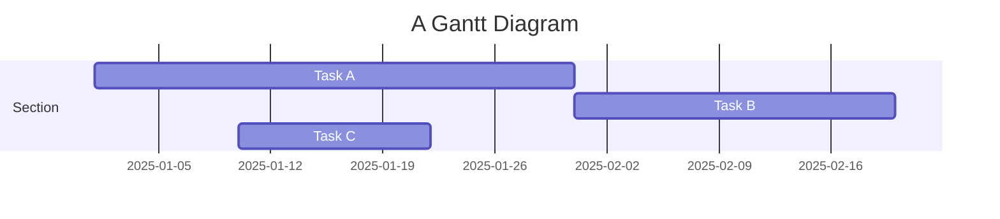
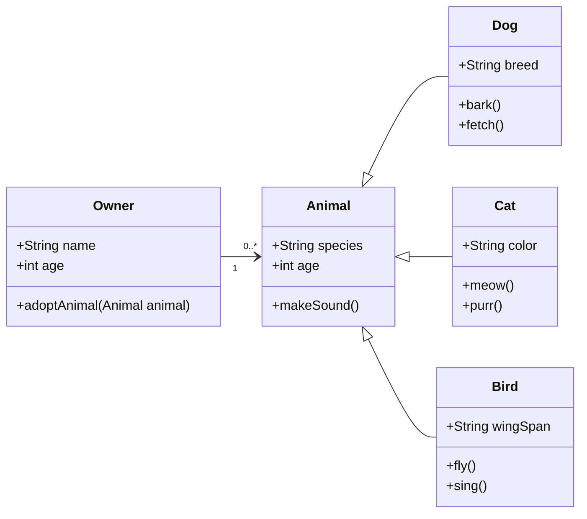

## Equations

This theme supports rendering beautiful math in inline and display modes using [MathJax 3](https://www.mathjax.org/) engine.
You just need to surround your math expression with `$$`, like `$$ E = mc^2 $$`.
If you leave it inside a paragraph, it will produce an inline expression, just like $$ E = mc^2 $$.

In fact, you can also use a single dollar sign `$` to create inline formulas, such as `$ E = mc^2 $`, which will render as $ E = mc^2 $. This approach provides the same effect during TeX-based compilation, but visually it appears slightly less bold compared to double-dollar signs `$$`, making it blend more naturally with surrounding text.

To use display mode, again surround your expression with `$$` and place it as a separate paragraph.
Here is an example:

$$
\left( \sum_{k=1}^n a_k b_k \right)^2 \leq \left( \sum_{k=1}^n a_k^2 \right) \left( \sum_{k=1}^n b_k^2 \right)
$$

Note that MathJax 3 is [a major re-write of MathJax](https://docs.mathjax.org/en/latest/upgrading/whats-new-3.0.html) that brought a significant improvement to the loading and rendering speed, which is now [on par with KaTeX](http://www.intmath.com/cg5/katex-mathjax-comparison.php).

---

## Citations

Citations are then used in the article body with the `<d-cite>` tag.
The key attribute is a reference to the id provided in the bibliography.
The key attribute can take multiple ids, separated by commas.

The citation is presented inline like this: <d-cite key="gregor2015draw"></d-cite> (a number that displays more information on hover).
If you have an appendix, a bibliography is automatically created and populated in it.

Distill chose a numerical inline citation style to improve readability of citation dense articles and because many of the benefits of longer citations are obviated by displaying more information on hover.
However, we consider it good style to mention author last names if you discuss something at length and it fits into the flow well — the authors are human and it’s nice for them to have the community associate them with their work.

---

## Footnotes

Just wrap the text you would like to show up in a footnote in a `<d-footnote>` tag.
The number of the footnote will be automatically generated.<d-footnote>This will become a hoverable footnote.</d-footnote>

---

## Code Blocks

Syntax highlighting is provided within `<d-code>` tags.
An example of inline code snippets: `<d-code language="html">let x = 10;</d-code>`.
For larger blocks of code, add a `block` attribute:

<d-code block language="javascript">
  var x = 25;
  function(x) {
    return x * x;
  }
</d-code>

**Note:** `<d-code>` blocks do not look good in the dark mode.
You can always use the default code-highlight using the `highlight` liquid tag:


var x = 25;
function(x) {
return x \* x;
}


---

## Interactive Plots

You can add interative plots using plotly + iframes :framed_picture:

<div class="l-page">
  <iframe src="{{ '/assets/plotly/demo.html' | relative_url }}" frameborder='0' scrolling='no' height="500px" width="100%" style="border: 1px dashed grey;"></iframe>
</div>

The plot must be generated separately and saved into an HTML file.
To generate the plot that you see above, you can use the following code snippet:


import pandas as pd
import plotly.express as px
df = pd.read_csv(
'https://raw.githubusercontent.com/plotly/datasets/master/earthquakes-23k.csv'
)
fig = px.density_mapbox(
df,
lat='Latitude',
lon='Longitude',
z='Magnitude',
radius=10,
center=dict(lat=0, lon=180),
zoom=0,
mapbox_style="stamen-terrain",
)
fig.show()
fig.write_html('assets/plotly/demo.html')


---

## Details boxes

Details boxes are collapsible boxes which hide additional information from the user. They can be added with the `details` liquid tag:


Additional details, where math $$ 2x - 1 $$ and `code` is rendered correctly.


---

## Mermaid

This theme supports creating diagrams directly in markdown using [Mermaid](https://mermaid.js.org/). Mermaid enables users to render flowcharts, sequence diagrams, class diagrams, Gantt charts, and more. Simply embed the diagram syntax within a mermaid code block.

To create a Gantt chart, you can use the following syntax:

````markdown

````

And here’s how it will be rendered:


Similarly, you can also use it to create beautiful class diagrams:

````

````

It will be presented as:


With Mermaid, you can easily add clear and dynamic diagrams to enhance your blog content.

---

## Diff2Html

This theme also supports integrating [Diff2Html](https://github.com/rtfpessoa/diff2html), a tool that beautifully renders code differences (diffs) directly in markdown. Diff2Html is ideal for showcasing code changes, allowing you to clearly present additions, deletions, and modifications. It’s perfect for code reviews, documentation, and tutorials where step-by-step code changes need to be highlighted—you can even introduce changes across multiple files at once.

````markdown
```diff2html
diff --git a/utils/mathUtils.js b/utils/mathUtils.js
index 3b5f3d1..c7f9b2e 100644
--- a/utils/mathUtils.js
+++ b/utils/mathUtils.js
@@ -1,8 +1,12 @@
-// Basic math utilities
+// Extended math utilities with additional functions

-export function calculateArea(radius) {
-    const PI = 3.14159;
+export function calculateCircleMetrics(radius) {
+    const PI = Math.PI;
     const area = PI * radius ** 2;
+    const circumference = 2 * PI * radius;
+
+    if (!isValidRadius(radius)) throw new Error("Invalid radius");
+
     return { area, circumference };
 }

-export function validateRadius(radius) {
+export function isValidRadius(radius) {
     return typeof radius === 'number' && radius > 0;
 }

diff --git a/main.js b/main.js
index 5f6a9c3..b7d4e8f 100644
--- a/main.js
+++ b/main.js
@@ -2,9 +2,12 @@
 import { calculateCircleMetrics } from './utils/mathUtils';

-function displayCircleMetrics(radius) {
-    const { area } = calculateCircleMetrics(radius);
+function displayCircleMetrics(radius) {
+    const { area, circumference } = calculateCircleMetrics(radius);
     console.log(`Area: ${area}`);
+    console.log(`Circumference: ${circumference}`);
 }

-displayCircleMetrics(5);
+try {
+    displayCircleMetrics(5);
+} catch (error) {
+    console.error("Error:", error.message);
+}
```
````

Here’s how it will look when rendered with Diff2Html:

```diff2html
diff --git a/utils/mathUtils.js b/utils/mathUtils.js
index 3b5f3d1..c7f9b2e 100644
--- a/utils/mathUtils.js
+++ b/utils/mathUtils.js
@@ -1,8 +1,12 @@
-// Basic math utilities
+// Extended math utilities with additional functions

-export function calculateArea(radius) {
-    const PI = 3.14159;
+export function calculateCircleMetrics(radius) {
+    const PI = Math.PI;
     const area = PI * radius ** 2;
+    const circumference = 2 * PI * radius;
+
+    if (!isValidRadius(radius)) throw new Error("Invalid radius");
+
     return { area, circumference };
 }

-export function validateRadius(radius) {
+export function isValidRadius(radius) {
     return typeof radius === 'number' && radius > 0;
 }

diff --git a/main.js b/main.js
index 5f6a9c3..b7d4e8f 100644
--- a/main.js
+++ b/main.js
@@ -2,9 +2,12 @@
 import { calculateCircleMetrics } from './utils/mathUtils';

-function displayCircleMetrics(radius) {
-    const { area } = calculateCircleMetrics(radius);
+function displayCircleMetrics(radius) {
+    const { area, circumference } = calculateCircleMetrics(radius);
     console.log(`Area: ${area}`);
+    console.log(`Circumference: ${circumference}`);
 }

-displayCircleMetrics(5);
+try {
+    displayCircleMetrics(5);
+} catch (error) {
+    console.error("Error:", error.message);
+}
```

---

## Leaflet

[Leaflet](https://leafletjs.com/) is created by Ukrainian software engineer [Volodymyr Agafonkin](https://agafonkin.com/), allowing interactive maps to be embedded in webpages. With support for [GeoJSON data](https://geojson.org/), Leaflet allows you to highlight specific regions, making it easy to visualize geographical information in detail.

You can use the following code to load map information on [OpenStreetMap](https://www.openstreetmap.org/):

````markdown
```geojson
{
  "type": "FeatureCollection",
  "features": [
    {
      "type": "Feature",
      "properties": {
        "name": "Crimea",
        "popupContent": "Occupied Crimea"
      },
      "geometry": {
        "type": "Polygon",
        "coordinates": [
          [
            [
              33.9,
              45.3
            ],
            [
              36.5,
              45.3
            ],
            [
              36.5,
              44.4
            ],
            [
              33.9,
              44.4
            ],
            [
              33.9,
              45.3
            ]
          ]
        ]
      }
    },
    {
      "type": "Feature",
      "properties": {
        "name": "Donetsk",
        "popupContent": "Occupied Donetsk"
      },
      "geometry": {
        "type": "Polygon",
        "coordinates": [
          [
            [
              37.5,
              48.5
            ],
            [
              39.5,
              48.5
            ],
            [
              39.5,
              47.5
            ],
            [
              37.5,
              47.5
            ],
            [
              37.5,
              48.5
            ]
          ]
        ]
      }
    },
    {
      "type": "Feature",
      "properties": {
        "name": "Luhansk",
        "popupContent": "Occupied Luhansk"
      },
      "geometry": {
        "type": "Polygon",
        "coordinates": [
          [
            [
              38.5,
              49.5
            ],
            [
              40.5,
              49.5
            ],
            [
              40.5,
              48.5
            ],
            [
              38.5,
              48.5
            ],
            [
              38.5,
              49.5
            ]
          ]
        ]
      }
    },
    {
      "type": "Feature",
      "properties": {
        "name": "Kherson",
        "popupContent": "Occupied Kherson"
      },
      "geometry": {
        "type": "Polygon",
        "coordinates": [
          [
            [
              32.3,
              47.3
            ],
            [
              34.3,
              47.3
            ],
            [
              34.3,
              46.3
            ],
            [
              32.3,
              46.3
            ],
            [
              32.3,
              47.3
            ]
          ]
        ]
      }
    },
    {
      "type": "Feature",
      "properties": {
        "name": "Zaporizhzhia",
        "popupContent": "Occupied Zaporizhzhia"
      },
      "geometry": {
        "type": "Polygon",
        "coordinates": [
          [
            [
              34.3,
              48
            ],
            [
              36.3,
              48
            ],
            [
              36.3,
              47
            ],
            [
              34.3,
              47
            ],
            [
              34.3,
              48
            ]
          ]
        ]
      }
    }
  ]
}
```
````

The rendered map below highlights the regions of Ukraine that have been illegally occupied by Russia over the years, including Crimea and the four eastern regions:

```geojson
{
  "type": "FeatureCollection",
  "features": [
    {
      "type": "Feature",
      "properties": {
        "name": "Crimea",
        "popupContent": "Occupied Crimea"
      },
      "geometry": {
        "type": "Polygon",
        "coordinates": [
          [
            [
              33.9,
              45.3
            ],
            [
              36.5,
              45.3
            ],
            [
              36.5,
              44.4
            ],
            [
              33.9,
              44.4
            ],
            [
              33.9,
              45.3
            ]
          ]
        ]
      }
    },
    {
      "type": "Feature",
      "properties": {
        "name": "Donetsk",
        "popupContent": "Occupied Donetsk"
      },
      "geometry": {
        "type": "Polygon",
        "coordinates": [
          [
            [
              37.5,
              48.5
            ],
            [
              39.5,
              48.5
            ],
            [
              39.5,
              47.5
            ],
            [
              37.5,
              47.5
            ],
            [
              37.5,
              48.5
            ]
          ]
        ]
      }
    },
    {
      "type": "Feature",
      "properties": {
        "name": "Luhansk",
        "popupContent": "Occupied Luhansk"
      },
      "geometry": {
        "type": "Polygon",
        "coordinates": [
          [
            [
              38.5,
              49.5
            ],
            [
              40.5,
              49.5
            ],
            [
              40.5,
              48.5
            ],
            [
              38.5,
              48.5
            ],
            [
              38.5,
              49.5
            ]
          ]
        ]
      }
    },
    {
      "type": "Feature",
      "properties": {
        "name": "Kherson",
        "popupContent": "Occupied Kherson"
      },
      "geometry": {
        "type": "Polygon",
        "coordinates": [
          [
            [
              32.3,
              47.3
            ],
            [
              34.3,
              47.3
            ],
            [
              34.3,
              46.3
            ],
            [
              32.3,
              46.3
            ],
            [
              32.3,
              47.3
            ]
          ]
        ]
      }
    },
    {
      "type": "Feature",
      "properties": {
        "name": "Zaporizhzhia",
        "popupContent": "Occupied Zaporizhzhia"
      },
      "geometry": {
        "type": "Polygon",
        "coordinates": [
          [
            [
              34.3,
              48
            ],
            [
              36.3,
              48
            ],
            [
              36.3,
              47
            ],
            [
              34.3,
              47
            ],
            [
              34.3,
              48
            ]
          ]
        ]
      }
    }
  ]
}
```

---

## Chartjs, Echarts and Vega-Lite

[Chart.js](https://www.chartjs.org/) is a versatile JavaScript library for creating responsive and interactive charts. Supporting multiple chart types like bar, line, pie, and radar, it’s an ideal tool for visualizing data directly in webpages.

Here’s an example of a JSON-style configuration that creates a bar chart in Chart.js:

````
```chartjs
{
  "type": "bar",
  "data": {
    "labels": ["2017", "2018", "2019", "2020", "2021"],
    "datasets": [
      {
        "label": "Population (millions)",
        "data": [12, 15, 13, 14, 16],
        "backgroundColor": "rgba(54, 162, 235, 0.6)",
        "borderColor": "rgba(54, 162, 235, 1)",
        "borderWidth": 1
      }
    ]
  },
  "options": {
    "scales": {
      "y": {
        "beginAtZero": true
      }
    }
  }
}
```
````

The rendered bar chart illustrates population data from 2017 to 2021:

```chartjs
{
  "type": "bar",
  "data": {
    "labels": ["2017", "2018", "2019", "2020", "2021"],
    "datasets": [
      {
        "label": "Population (millions)",
        "data": [12, 15, 13, 14, 16],
        "backgroundColor": "rgba(54, 162, 235, 0.6)",
        "borderColor": "rgba(54, 162, 235, 1)",
        "borderWidth": 1
      }
    ]
  },
  "options": {
    "scales": {
      "y": {
        "beginAtZero": true
      }
    }
  }
}
```

---

[ECharts](https://echarts.apache.org/) is a powerful visualization library from [Apache](https://www.apache.org/) that supports a wide range of interactive charts, including more advanced types such as scatter plots, heatmaps, and geographic maps.

The following JSON configuration creates a visually enhanced line chart that displays monthly sales data for two products.

````
```echarts
{
  "title": {
    "text": "Monthly Sales Comparison",
    "left": "center"
  },
  "tooltip": {
    "trigger": "axis",
    "backgroundColor": "rgba(50, 50, 50, 0.7)",
    "borderColor": "#777",
    "borderWidth": 1,
    "textStyle": {
      "color": "#fff"
    }
  },
  "legend": {
    "data": ["Product A", "Product B"],
    "top": "10%"
  },
  "xAxis": {
    "type": "category",
    "data": ["Jan", "Feb", "Mar", "Apr", "May", "Jun", "Jul", "Aug", "Sep", "Oct", "Nov", "Dec"],
    "axisLine": {
      "lineStyle": {
        "color": "#888"
      }
    }
  },
  "yAxis": {
    "type": "value",
    "axisLine": {
      "lineStyle": {
        "color": "#888"
      }
    },
    "splitLine": {
      "lineStyle": {
        "type": "dashed"
      }
    }
  },
  "series": [
    {
      "name": "Product A",
      "type": "line",
      "smooth": true,
      "data": [820, 932, 901, 934, 1290, 1330, 1320, 1400, 1450, 1500, 1600, 1650],
      "itemStyle": {
        "color": "#5470C6"
      },
      "lineStyle": {
        "width": 3
      },
      "areaStyle": {
        "color": {
          "type": "linear",
          "x": 0,
          "y": 0,
          "x2": 0,
          "y2": 1,
          "colorStops": [
            { "offset": 0, "color": "rgba(84, 112, 198, 0.5)" },
            { "offset": 1, "color": "rgba(84, 112, 198, 0)" }
          ]
        }
      },
      "emphasis": {
        "focus": "series"
      }
    },
    {
      "name": "Product B",
      "type": "line",
      "smooth": true,
      "data": [620, 732, 701, 734, 1090, 1130, 1120, 1200, 1250, 1300, 1400, 1450],
      "itemStyle": {
        "color": "#91CC75"
      },
      "lineStyle": {
        "width": 3
      },
      "areaStyle": {
        "color": {
          "type": "linear",
          "x": 0,
          "y": 0,
          "x2": 0,
          "y2": 1,
          "colorStops": [
            { "offset": 0, "color": "rgba(145, 204, 117, 0.5)" },
            { "offset": 1, "color": "rgba(145, 204, 117, 0)" }
          ]
        }
      },
      "emphasis": {
        "focus": "series"
      }
    }
  ]
}
```
````

The rendered output is shown below, and you can also interact with it using your mouse:

```echarts
{
  "title": {
    "text": "Monthly Sales Comparison",
    "left": "center"
  },
  "tooltip": {
    "trigger": "axis",
    "backgroundColor": "rgba(50, 50, 50, 0.7)",
    "borderColor": "#777",
    "borderWidth": 1,
    "textStyle": {
      "color": "#fff"
    }
  },
  "legend": {
    "data": ["Product A", "Product B"],
    "top": "10%"
  },
  "xAxis": {
    "type": "category",
    "data": ["Jan", "Feb", "Mar", "Apr", "May", "Jun", "Jul", "Aug", "Sep", "Oct", "Nov", "Dec"],
    "axisLine": {
      "lineStyle": {
        "color": "#888"
      }
    }
  },
  "yAxis": {
    "type": "value",
    "axisLine": {
      "lineStyle": {
        "color": "#888"
      }
    },
    "splitLine": {
      "lineStyle": {
        "type": "dashed"
      }
    }
  },
  "series": [
    {
      "name": "Product A",
      "type": "line",
      "smooth": true,
      "data": [820, 932, 901, 934, 1290, 1330, 1320, 1400, 1450, 1500, 1600, 1650],
      "itemStyle": {
        "color": "#5470C6"
      },
      "lineStyle": {
        "width": 3
      },
      "areaStyle": {
        "color": {
          "type": "linear",
          "x": 0,
          "y": 0,
          "x2": 0,
          "y2": 1,
          "colorStops": [
            { "offset": 0, "color": "rgba(84, 112, 198, 0.5)" },
            { "offset": 1, "color": "rgba(84, 112, 198, 0)" }
          ]
        }
      },
      "emphasis": {
        "focus": "series"
      }
    },
    {
      "name": "Product B",
      "type": "line",
      "smooth": true,
      "data": [620, 732, 701, 734, 1090, 1130, 1120, 1200, 1250, 1300, 1400, 1450],
      "itemStyle": {
        "color": "#91CC75"
      },
      "lineStyle": {
        "width": 3
      },
      "areaStyle": {
        "color": {
          "type": "linear",
          "x": 0,
          "y": 0,
          "x2": 0,
          "y2": 1,
          "colorStops": [
            { "offset": 0, "color": "rgba(145, 204, 117, 0.5)" },
            { "offset": 1, "color": "rgba(145, 204, 117, 0)" }
          ]
        }
      },
      "emphasis": {
        "focus": "series"
      }
    }
  ]
}
```

---

[Vega-Lite](https://vega.github.io/vega-lite/) is a declarative visualization grammar that allows users to create, share, and customize a wide range of interactive data visualizations. The following JSON configuration generates a straightforward bar chart:

````
```vega_lite
{
  "$schema": "https://vega.github.io/schema/vega/v5.json",
  "width": 400,
  "height": 200,
  "padding": 5,

  "data": [
    {
      "name": "table",
      "values": [
        {"category": "A", "value": 28},
        {"category": "B", "value": 55},
        {"category": "C", "value": 43},
        {"category": "D", "value": 91},
        {"category": "E", "value": 81},
        {"category": "F", "value": 53},
        {"category": "G", "value": 19},
        {"category": "H", "value": 87}
      ]
    }
  ],

  "scales": [
    {
      "name": "xscale",
      "type": "band",
      "domain": {"data": "table", "field": "category"},
      "range": "width",
      "padding": 0.1
    },
    {
      "name": "yscale",
      "type": "linear",
      "domain": {"data": "table", "field": "value"},
      "nice": true,
      "range": "height"
    }
  ],

  "axes": [
    {"orient": "bottom", "scale": "xscale"},
    {"orient": "left", "scale": "yscale"}
  ],

  "marks": [
    {
      "type": "rect",
      "from": {"data": "table"},
      "encode": {
        "enter": {
          "x": {"scale": "xscale", "field": "category"},
          "width": {"scale": "xscale", "band": 0.8},
          "y": {"scale": "yscale", "field": "value"},
          "y2": {"scale": "yscale", "value": 0},
          "fill": {"value": "steelblue"}
        },
        "update": {
          "fillOpacity": {"value": 1}
        },
        "hover": {
          "fill": {"value": "orange"}
        }
      }
    }
  ]
}
```
````

The rendered output shows a clean and simple bar chart with a hover effect：

```vega_lite
{
  "$schema": "https://vega.github.io/schema/vega/v5.json",
  "width": 400,
  "height": 200,
  "padding": 5,

  "data": [
    {
      "name": "table",
      "values": [
        {"category": "A", "value": 28},
        {"category": "B", "value": 55},
        {"category": "C", "value": 43},
        {"category": "D", "value": 91},
        {"category": "E", "value": 81},
        {"category": "F", "value": 53},
        {"category": "G", "value": 19},
        {"category": "H", "value": 87}
      ]
    }
  ],

  "scales": [
    {
      "name": "xscale",
      "type": "band",
      "domain": {"data": "table", "field": "category"},
      "range": "width",
      "padding": 0.1
    },
    {
      "name": "yscale",
      "type": "linear",
      "domain": {"data": "table", "field": "value"},
      "nice": true,
      "range": "height"
    }
  ],

  "axes": [
    {"orient": "bottom", "scale": "xscale"},
    {"orient": "left", "scale": "yscale"}
  ],

  "marks": [
    {
      "type": "rect",
      "from": {"data": "table"},
      "encode": {
        "enter": {
          "x": {"scale": "xscale", "field": "category"},
          "width": {"scale": "xscale", "band": 0.8},
          "y": {"scale": "yscale", "field": "value"},
          "y2": {"scale": "yscale", "value": 0},
          "fill": {"value": "steelblue"}
        },
        "update": {
          "fillOpacity": {"value": 1}
        },
        "hover": {
          "fill": {"value": "orange"}
        }
      }
    }
  ]
}
```

---

## TikZ

[TikZ](https://tikz.net/) is a powerful LaTeX-based drawing tool powered by [TikZJax](https://tikzjax.com/). You can easily port TikZ drawings from papers, posters, and notes. For example, we can use the following code to illustrate Euler’s formula $ e^{i \theta} = \cos \theta + i \sin \theta $:

```markdown
<script type="text/tikz">
\begin{tikzpicture}
    \filldraw[fill=cyan!10, draw=blue, thick] (0,0) circle (2cm);

    \draw[->, thick] (-2.5,0) -- (2.5,0) node[right] {Re};
    \draw[->, thick] (0,-2.5) -- (0,2.5) node[above] {Im};

    \draw[->, thick, color=purple] (0,0) -- (1.5,1.5);
    \node[color=purple] at (1.1, 1.7) {$e^{i\theta}$};

    \draw[thick] (0.7,0) arc (0:45:0.7);
    \node at (0.9, 0.3) {$\theta$};

    \draw[dashed, color=gray] (1.5,1.5) -- (1.5,0) node[below, black] {$\cos \theta$};
    \draw[dashed, color=gray] (1.5,1.5) -- (0,1.5) node[left, black] {$\sin \theta$};
    \node at (2.2, 0) [below] {1}; 
    \node at (0, 2.2) [left] {$i$}; 
    \node at (1.5,1.5) [above right, color=blue] {$(\cos \theta \, \sin \theta)$}; 
\end{tikzpicture}
</script>
```

The rendered output is shown below, displayed as a vector graphic：

<script type="text/tikz">
\begin{tikzpicture}
    \filldraw[fill=cyan!10, draw=blue, thick] (0,0) circle (2cm);

    \draw[->, thick] (-2.5,0) -- (2.5,0) node[right] {Re};
    \draw[->, thick] (0,-2.5) -- (0,2.5) node[above] {Im};

    \draw[->, thick, color=purple] (0,0) -- (1.5,1.5);
    \node[color=purple] at (1.1, 1.7) {$e^{i\theta}$};

    \draw[thick] (0.7,0) arc (0:45:0.7);
    \node at (0.9, 0.3) {$\theta$};

    \draw[dashed, color=gray] (1.5,1.5) -- (1.5,0) node[below, black] {$\cos \theta$};
    \draw[dashed, color=gray] (1.5,1.5) -- (0,1.5) node[left, black] {$\sin \theta$};
    \node at (2.2, 0) [below] {1}; 
    \node at (0, 2.2) [left] {$i$}; 
    \node at (1.5,1.5) [above right, color=blue] {$(\cos \theta \, \sin \theta)$}; 
\end{tikzpicture}
</script>

---

## Typograms

[Typograms](https://google.github.io/typograms/) are a way of combining text and graphics to convey information in a clear and visually engaging manner. Typograms are particularly effective for illustrating simple diagrams, charts, and concept visuals where text and graphics are closely integrated. The following example demonstrates a simple Typogram:

````
```typograms
             ___________________
            /                  /|
           /__________________/ |
          |                  |  |
          |     Distill      |  |
          |                  |  |
          |                  | /
          |__________________|/
```
````

The rendered output is shown below：

```typograms
             ___________________
            /                  /|
           /__________________/ |
          |                  |  |
          |     Distill      |  |
          |                  |  |
          |                  | /
          |__________________|/
```

---

## Layouts

The main text column is referred to as the body.
It is the assumed layout of any direct descendants of the `d-article` element.

<div class="fake-img l-body">
  <p>.l-body</p>
</div>

For images you want to display a little larger, try `.l-page`:

<div class="fake-img l-page">
  <p>.l-page</p>
</div>

All of these have an outset variant if you want to poke out from the body text a little bit.
For instance:

<div class="fake-img l-body-outset">
  <p>.l-body-outset</p>
</div>

<div class="fake-img l-page-outset">
  <p>.l-page-outset</p>
</div>

Occasionally you’ll want to use the full browser width.
For this, use `.l-screen`.
You can also inset the element a little from the edge of the browser by using the inset variant.

<div class="fake-img l-screen">
  <p>.l-screen</p>
</div>
<div class="fake-img l-screen-inset">
  <p>.l-screen-inset</p>
</div>

The final layout is for marginalia, asides, and footnotes.
It does not interrupt the normal flow of `.l-body` sized text except on mobile screen sizes.

<div class="fake-img l-gutter">
  <p>.l-gutter</p>
</div>

---

## Other Typography?

Emphasis, aka italics, with _asterisks_ (`*asterisks*`) or _underscores_ (`_underscores_`).

Strong emphasis, aka bold, with **asterisks** or **underscores**.

Combined emphasis with **asterisks and _underscores_**.

Strikethrough uses two tildes. ~~Scratch this.~~

1. First ordered list item
2. Another item
   ⋅⋅\* Unordered sub-list.
3. Actual numbers don't matter, just that it's a number
   ⋅⋅1. Ordered sub-list
4. And another item.

⋅⋅⋅You can have properly indented paragraphs within list items. Notice the blank line above, and the leading spaces (at least one, but we'll use three here to also align the raw Markdown).

⋅⋅⋅To have a line break without a paragraph, you will need to use two trailing spaces.⋅⋅
⋅⋅⋅Note that this line is separate, but within the same paragraph.⋅⋅
⋅⋅⋅(This is contrary to the typical GFM line break behaviour, where trailing spaces are not required.)

- Unordered list can use asterisks

* Or minuses

- Or pluses

[I'm an inline-style link](https://www.google.com)

[I'm an inline-style link with title](https://www.google.com "Google's Homepage")

[I'm a reference-style link][Arbitrary case-insensitive reference text]

[You can use numbers for reference-style link definitions][1]

Or leave it empty and use the [link text itself].

URLs and URLs in angle brackets will automatically get turned into links.
http://www.example.com or <http://www.example.com> and sometimes
example.com (but not on Github, for example).

Some text to show that the reference links can follow later.

[arbitrary case-insensitive reference text]: https://www.mozilla.org
[1]: http://slashdot.org
[link text itself]: http://www.reddit.com

Here's our logo (hover to see the title text):

Inline-style:


Reference-style:
![alt text][logo]

[logo]: https://github.com/adam-p/markdown-here/raw/master/src/common/images/icon48.png "Logo Title Text 2"

Inline `code` has `back-ticks around` it.

```javascript
var s = "JavaScript syntax highlighting";
alert(s);
```

```python
s = "Python syntax highlighting"
print s
```

```
No language indicated, so no syntax highlighting.
But let's throw in a <b>tag</b>.
```

Colons can be used to align columns.

| Tables        |      Are      |  Cool |
| ------------- | :-----------: | ----: |
| col 3 is      | right-aligned | $1600 |
| col 2 is      |   centered    |   $12 |
| zebra stripes |   are neat    |    $1 |

There must be at least 3 dashes separating each header cell.
The outer pipes (|) are optional, and you don't need to make the
raw Markdown line up prettily. You can also use inline Markdown.

| Markdown | Less      | Pretty     |
| -------- | --------- | ---------- |
| _Still_  | `renders` | **nicely** |
| 1        | 2         | 3          |

> Blockquotes are very handy in email to emulate reply text.
> This line is part of the same quote.

Quote break.

> This is a very long line that will still be quoted properly when it wraps. Oh boy let's keep writing to make sure this is long enough to actually wrap for everyone. Oh, you can _put_ **Markdown** into a blockquote.

Here's a line for us to start with.

This line is separated from the one above by two newlines, so it will be a _separate paragraph_.

This line is also a separate paragraph, but...
This line is only separated by a single newline, so it's a separate line in the _same paragraph_.
