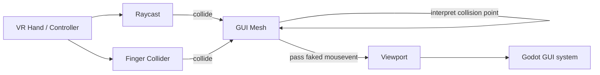

## TL;DR

For the Godot VR Toolkit I wanted **proper GUI interaction in VR** without rewriting or reinventing the wheel.
So, I kept using **normal Godot `Control` nodes** and made them think they were being used with a mouse:

- A `Viewport` hosts a regular 2D UI.
- `ViewportToMesh.gd` renders that viewport onto a 3D mesh in the world.
- `GuiInteraction.gd` casts rays from VR controllers into that mesh.
- `GuiFinger.gd` tracks a finger tip collider for "poking" the UI.
- Both systems compute 2D coordinates inside the viewport and then **synthesize `InputEventMouseMotion` / `InputEventMouseButton`** so the UI believes a mouse is moving and clicking.

Result: 3D VR hands, laser pointer, hovering, clicking, dragging -- but under the hood it's still just **mouse events and a viewport**.

The implementation can be found on [Github](https://github.com/boku-ilen/godot-vr-toolkit/blob/master/addons/vr-toolkit/Gui/).

---

## The 2D vs. 3D UI Problem

Godot is fundamentally stable and user-friendly at 2D GUIs: `Control` hierarchies, themes, focus handling, signals -- all the usual desktop UI goodies.

VR, on the other hand, lives entirely in 3D: controllers/hand meshes, raycasts, spatial interactions and depth perception.
What you _don't_ have is a mouse pointer.

Traditionally, user interface interactions in VR are handled by casting a ray from the controller (like a "laser pointer") or by directly pinching, hence touching objects with a virtual hand/finger.
Naively, you could:

1. Implement a new VR-specific widget set (buttons, sliders, etc.),
2. Or try to hack `Control`s to understand "rays" and "fingers".

Both approaches quickly turn into a rabbit hole of **"oh right, I also need hover, drag, scroll, focus, keyboard..."**.

So instead I went for a "cheaper" trick that reuses Godot's existing 2D GUI system as much as possible;:

> What if we keep the entire 2D GUI stack as-is and just pretend we're a mouse?

That leads to a very simple mental model:

- From VR's perspective: _“I cast a ray / move a finger to a panel.”_
- From the UI's perspective: _“The mouse moved to `(x, y)` and clicked.”_

Everything in between is just coordinate transformations and synthetic input events.

---

## Overview of the Setup

The three main scripts in play are:

- [`ViewportToMesh.gd`](https://github.com/boku-ilen/godot-vr-toolkit/blob/master/addons/vr-toolkit/Gui/ViewportToMesh.gd)  
  Renders a 2D `Viewport` (with `Control`s) onto a 3D mesh, including UV coordinate handling.

- [`GuiInteraction.gd`](https://github.com/boku-ilen/godot-vr-toolkit/blob/master/addons/vr-toolkit/Gui/GuiInteraction.gd)  
  Handles ray-based interaction: a “laser pointer” from the controller that hits the GUI mesh.

- [`GuiFinger.gd`](https://github.com/boku-ilen/godot-vr-toolkit/blob/master/addons/vr-toolkit/Gui/GuiFinger.gd)  
  Handles fingertip interaction: a collider on the tip of a VR hand that can “press” UI buttons directly.

In a slightly simplified picture:



The resulting faked mouse events are then processed by Godot's normal GUI system, triggering hover states, button presses, etc..

## ViewportToMesh - putting UI into the world

The starting point is trivial -- rendering a UI to a texture and show it on a mesh:

- Inside that viewport lives a normal 2D UI:
  - Buttons, sliders, checkboxes, etc.
- `ViewportToMesh`:
  - has a `SpatialMaterial` that takes a viewport texture (`Albedo` -> `Texture` -> `New ViewportTexture`)
  - an export variable (`PackedScene`) to assign the `Viewport` node
  - ensures UVs line up so that `(0,0)` in UV corresponds to `(0,0)` in the viewport, and `(1,1)` to `(width, height)`
  - sets an `Area` and `CollisionShape` on the mesh to match the viewport size (e.g. a plane of size `width x height`) for querying collisions

As a node-hierarchy this might look like:

```
Spatial (World)
    ├── ViewportToMesh (MeshInstance)
    │    ├── Area
    │    │    └── CollisionShape
    │    └── Viewport (instanced PackedScene)
    ...
```



Conceptually, when a ray hits the mesh, we get:

1. The hit position in local coordinates
2. The UV coordinate of that point on the mesh
3. The corresponding pixel in the viewport

## Ray-based Interaction -- the VR laser pointer

The ray-based interaction lives in `GuiInteraction.gd`; a ray originates from the VR controller (or camera), which -- every frame -- it casts into the world. This gives a classic **laser-pointer style UI**:

- visual line from controller to panel.
- cursor on the panel (optionally drawn in the viewport).
- trigger button maps to “left mouse button”.

The interesting bit is not the raycast itself (that's standard Godot), but what happens in `_send_mouse_motion` and `_send_mouse_button` -- that's where we fake mouse events.



## Finger-based Interaction -- poking buttons

`GuiFinger.gd` is the second interaction mode: **direct hand interaction**.

Instead of a laser pointer, we have:

- A VR hand skeleton or mesh.
- A collider on the fingertip (e.g. index finger).
- The finger collider collides with the GUI mesh.

The flow is essentially:

1. The finger collider overlaps with the GUI mesh or a dedicated interaction volume.
2. From the collision, we again get:
   - Contact point on the mesh,
   - UV coordinate at that point.
3. From UV we compute viewport coordinates.
4. From those coordinates we synthesize:
   - Hover events while finger is near the surface,
   - A “click” when the finger crosses some threshold (e.g. penetration depth / velocity / pinch gesture).

Where the ray pointer feels a bit like a laser pointer/remote, **finger interaction feels like actually poking the UI** -- but internally, both boil down to the same `InputEventMouse`-machinery.

## Faking Mouse Events

Now the fun part: **lying to Godot's GUI**.

The goal: from the GUI's perspective, nothing special is happening. It just sees mouse movement and clicks.

### 1. Function overview

```gdscript
func ray_interaction_input(position3D: Vector3, event_type, device_id, pressed=null):
```

This function turns a **3D hit position on the GUI mesh** into a **2D mouse-like input event** for a viewport.

- `position3D`: where the ray (or fingertip) hit the GUI in world space.
- `event_type`: which kind of mouse event to create (`InputEventMouseMotion` or `InputEventMouseButton`).
- `device_id`: which input device (controller) this event belongs to.
- `pressed`: only relevant for button events, indicates down/up.

The rest of the function:

1. Converts coordinates into viewport space.
2. Builds the appropriate mouse event.
3. Sends it into the viewport so regular Godot `Control` nodes react to it.

### 2. World -> local -> 2D panel coordinates

```gdscript
	position3D = area.global_transform.affine_inverse() * position3D
	var position2D = Vector2(position3D.x, position3D.z)
```

- `area.global_transform.affine_inverse()` converts the world-space hit position into the **local space of `area`** (the GUI panel / collision area).
- Because the panel is rotated by 90°, its surface is aligned in the **X--Z plane**.
- So we keep only `(x, z)` and throw away the third dimension, ending up with a **2D point on the panel**: `position2D`.

At this point, `position2D` still uses the panel's own local units, centered on its origin.

### 3. Local panel coordinates -> normalized UV -> viewport pixels

#### Centered local range -> 0-based quad range

```gdscript
	position2D.x += quad_mesh_size.x / 2
	position2D.y += quad_mesh_size.y / 2
```

- The quad is centered at `(0, 0)` with extents `±quad_mesh_size/2`.
- By adding half the size, we shift the coordinate system so it runs from **0 to `quad_mesh_size`** in both directions.
- Now `(0, 0)` is one corner of the quad and `(quad_mesh_size.x, quad_mesh_size.y)` is the opposite corner.

#### Quad range -> normalized 0..1

```gdscript
	position2D.x = position2D.x / quad_mesh_size.x
	position2D.y = position2D.y / quad_mesh_size.y
```

- Dividing by the mesh size converts the coordinates into **normalized UV space**:
  - `0.0` -> start of the axis,
  - `1.0` -> end of the axis.

So `position2D` is now in the range `(0..1, 0..1)` and basically matches the UVs of the quad.

#### Normalized UV -> viewport pixel coordinates

```gdscript
	position2D.x = position2D.x * viewport.size.x
	position2D.y = position2D.y * viewport.size.y
```

- Multiplying the normalized values by the viewport size maps them to **actual pixel positions** inside the viewport.
- Now:
  - `(0, 0)` is the top-left corner of the viewport.
  - `(viewport.size.x, viewport.size.y)` is the bottom-right.

This is exactly the coordinate system Godot's GUI expects for mouse events.

---

## 4. Creating and configuring the mouse event

```gdscript
	var event = event_type.new()
```

Here we instantiate whichever mouse event type was passed in (`InputEventMouseMotion` or `InputEventMouseButton`).

### Mouse motion

```gdscript
	if event is InputEventMouseMotion:
		if last_pos2D == null:
			event.relative = Vector2(0, 0)
		else:
			event.relative = position2D - last_pos2D
```

- For **motion events**, besides the absolute position we also fill `relative`:
  - If this is the first event, there is no previous position -> relative movement is `(0, 0)`.
  - Otherwise we subtract `last_pos2D` from the new position for a **movement delta**.
- This delta can be used internally by Godot or custom logic to know how far the pointer moved.

### Mouse button

```gdscript
	elif event is InputEventMouseButton:
		event.button_index = 1
		event.pressed = pressed
```

- For **button events**, we set:
  - `button_index = 1` -> left mouse button.
  - `pressed` -> uses the argument passed into the function to differentiate between button-down and button-up.

---

## 5. Final bookkeeping and sending the event

```gdscript
	last_pos2D = position2D
	event.position = position2D
	event.global_position = position2D

	event.device = device_id
	viewport.input(event)
```

- `last_pos2D` is updated so the next motion event can compute a correct `relative` delta.
- `event.position` and `event.global_position` are both set to the computed viewport coordinates (for GUI, these are typically the same).
- `event.device` identifies which controller generated this event.
- Finally, `viewport.input(event)` injects the event into the viewport's input pipeline.

From this point on, Godot treats it like a **normal mouse event**:

- Buttons, sliders, and other `Control` nodes react to hover and clicks.
- No special VR logic is needed in the UI layer -- everything is handled via synthetic mouse events.

The nice part is that **dragging a slider** via a VR ray is literally the same code path as dragging it with a real mouse.

## Edge Cases, Trade-offs and Thoughts

This approach works surprisingly well, but it's not magic. A few gotchas and design decisions:

### 1. Coordinate precision & panel curvature

If you bend or distort your mesh (curved UI panels), you have to ensure:

- UVs are still meaningful,
- or you compute projection more explicitly (e.g. project onto plane, then transform).

`ViewportToMesh` acts as the contract: its job is to make sure **“UV -> viewport pixel”** stays consistent.

### 2. Focus and keyboard input

Mouse is only half the story:

- Text input, keyboard focus, etc., still follow the usual Godot rules.
- Depending on your VR keyboard solution, you may want to:
  - Programmatically focus controls,
  - Forward `InputEventKey` from a VR keyboard into the viewport.

The nice thing: you **don't** have to change how `LineEdit` or `TextEdit` work, you just feed them events.

### 3. Multiple pointers / hands

In VR you might have:

- Left-hand ray,
- Right-hand ray,
- Fingers on both hands.

The mouse model assumes a single pointer. In practice, I make a conscious decision:

- Only one “active” pointer at a time.
- Usually taken from “last device that interacted” or a prioritized order (e.g. right-hand ray > finger > left-hand ray).

For more complex setups you could emulate multiple mice by tagging events, but that quickly diverges from Godot's standard assumptions.

### 4. When _not_ to fake mouse events

Not every VR interaction needs to pretend to be a mouse:

- Grabbing objects, teleportation, gunplay, etc. are better done via custom input handling.
- The “fake mouse” approach shines specifically when you want:
  - Menus,
  - Settings panels,
  - HUDs,
  - Anything that logically **is** a 2D UI, just spatially placed.

## Closing Thoughts

> **Start from the existing machinery, then adapt the edges.**

By bending the inputs to look like mouse events, I can:

- Reuse all of that,
- Keep VR interaction code relatively small,
- Avoid building a bespoke VR widget library.

The triad of `ViewportToMesh.gd`, `GuiInteraction.gd`, and `GuiFinger.gd` is essentially just:

- A 3D wrapper around a 2D viewport,
- Coordinate plumbing,
- And a thin layer of **input forgery**.

From the user's perspective it feels like **“of course I can point at that button and press it”**.  
From Godot's perspective, they just moved a mouse and clicked.

And that's exactly the kind of cheating I enjoy.
