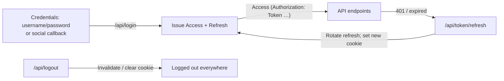

## TL;DR

As a small exercise, I moved Django-Rest-Knox to a **token-based auth** with **short-lived access tokens** and **rotate-on-use refresh tokens** stored in **HTTP-only, `Secure`, `SameSite` cookies**.
Key changes:

- **Knox** still issues/access-validates tokens, but **refresh is handled via dedicated endpoints** with rotation (old refresh invalidated, new refresh set).
- **CSRF** enforced on state-changing routes; **CORS** reduced to explicit origins; cookies are `HttpOnly+Secure` and scoped.
- **Logout** clears refresh cookie **and** invalidates access/refresh server-side; no dangling session cookies.

Result: less sticky auth state, clearer client flow, and fewer foot-guns when users jump across multiple SPAs.

---

## From Sessions to Tokens in Django

Django’s default authentication mechanism is a server-side, session-based system provided by its built-in auth framework. While this works perfectly for traditional, browser-rendered applications, modern platforms often expose APIs that are consumed by multiple clients: SPAs, mobile apps, or third-party integrations. In such cases, authentication requires a more flexible approach.

Django REST Knox extends Django REST Framework’s default TokenAuthentication with a more secure and scalable implementation: it supports multiple tokens per user (for different devices), stores token hashes instead of raw tokens in the database, and adds built-in token expiry handling.

Although no system can be entirely immune to compromise, single-token setups share a major weakness: once an attacker gains access to a valid token, they can impersonate the user until it expires. A more modern and secure alternative is the short-lived access token with a long-lived refresh token paradigm (s-a/l-r). Depending on the vulnerability, short usually refers to a time window of a few minutes to a few hours. In some 'strict' implementations the short-access is stored only in-memory and never saved into a local or session storage. Long refresh on the other hand usually means multiple hours to days.

<aside>
  It is important to note, that the major reason for using JWT usually is its statelessness and thus its portability and SSO-compatibility. So Knox authentication - even with the extension of a refresh-token - is still stateful: validation depends on a database lookup (the token table).
  That’s fundamentally different from a JWT, which is self-verifying (no lookup required).
</aside>

While frameworks such as JSON Web Token (JWT) - when configured accordingly - provide this pattern out-of-the-box, I decided to implement a refresh-token mechanism on top of Django REST Knox. While it serves as a security enhancement for a platform I developed, my key goal was a deeper understanding of modern authentication approaches; an advanced exercise in understanding (Django's) authentication internals.

<aside>
  

Above is an exemplary flow of a JWT setup where - after the authentication server served the token - validation no longer depends on this server.

</aside>

---

## What, Why and How?

In an s-a/l-r architecture, on login the user is granted a refresh token. Usually, this refresh token has an expiry of a longer period, say multiple days. Using this refresh token, they generate a short lived access token. This token alone provides is what

Why do we take this extra step? There is more than just one simple answer to this question; it is highly debated in the community and ultimately always a trade-off.

As mentioned above, one major threat of single-token setups is security. No system is entirely save and the possibility of a token being stolen cannot be fully eradicated. A short-lived access token does not mitigate the risk of tokens being stolen, they do however mitigate the attack surface in a time-dimension.

To actually obtain this security benefits, we have to ensure following implementation details:

- **Short-livedness of access tokens**: keep the access token as short-lived as arguable. Even if they are somehow hijacked, the risk potential is reduced severely.
- **HTTP-only refresh**: protect the long-lived aspect of the setup from being hijacked via XSS attacks by making it inaccessible for javascript
- **CSRF validation**: HTTP-only cookies are automatically included in every request to the backend. A malicious cross-site-request-forgery (CSRF) attack from another site to a state-changing endpoint may result in unwanted actions. We need to ensure we validate no such attack is happening from another site.

---

## Implementation Details: Backend

The goal of this exercise is to described by the flowchart below; it demonstrates the intended flow of logging in and out:



Instead of the plain (or maybe extended) `KnoxLoginView`, a custom `APIView` will be extended as `LoginView`. On valid login, a custom ORM-class `RefreshToken` will be created and a `HTTPOnly` cookie is set for the user using the `RefreshToken`s key. Simultaneously, an access-token - Knox's `AuthToken` - is created. In our vue SPA, we use a store for managing our authentication: each request to our server is proxied by the store - we check whether the access token is still valid, otherwise we try to refresh it using the `RefreshToken` which then is rotated. Any other case requires a new login attempt.

---

### Settings

First of all, in Django's `settings.py` we add two new variables to control the lifetimes of our tokens:

```py
from datetime import timedelta

REST_KNOX = {
    'TOKEN_TTL': timedelta(minutes=30)
}
REFRESH_TOKEN_TTL = timedelta(days=4)
```

### Refresh Token Model

As a second step, we implement our refresh-token. Multiple refresh-tokens per user should be possible to keep Knox's multi-device capabilities. Each refresh-token has a key, which is used to verify against the `HTTPOnly`cookie which is being set when logging in. The expiration-date of the refresh token is derived from `REFRESH_TOKEN_TTL`. Additionally, this model adds rotation and revocation logic, providing a mechanism similar to JWT refresh behavior but still database-controlled (stateful). With `RefreshToken.rotate` the current token is rendered invalid, while returning a newly created `RefreshToken`.

```python
from django.conf import settings
from django.db import models
from django.utils import timezone
import secrets

class RefreshToken(models.Model):
    user = models.ForeignKey(settings.AUTH_USER_MODEL, on_delete=models.CASCADE)
    key = models.CharField(max_length=255, unique=True, db_index=True)
    created = models.DateTimeField(auto_now_add=True)
    expires_at = models.DateTimeField()
    rotated = models.BooleanField(default=False)
    revoked = models.BooleanField(default=False)

    @classmethod
    def create(cls, user, expiration_time=settings.REFRESH_TOKEN_TTL):
        key = secrets.token_urlsafe(48)
        return cls.objects.create(
            user=user,
            key=key,
            expires_at=timezone.now() + expiration_time,
        )

    def rotate(self, expiration_time=settings.REFRESH_TOKEN_TTL):
        self.rotated = True
        self.save(update_fields=["rotated"])
        return self.__class__.create(self.user, expiration_time)

    def revoke(self):
      self.revoked = True
      self.save(update_fields["revoked"])
```

---

### Views Overview

To handle the refresh-token, we require a `Login`-, `Logout`- and most importantly `RefreshView`. To prevent csrf-theft we will decorate them with Django's `csrf_protect` decorator.

#### Login

We will use `rest_framework.authtoken.serializers.AuthTokenSerializer` to validate the user login attempt. On a successful login, we further create an access token (a `knox.models.AuthToken`) and a refresh token (or custom `RefreshToken`). The `AuthToken` implicitly takes its expiration date from the `TOKEN_TTL` setting we configured earlier.

```python
from rest_framework.views import APIView
from rest_framework.response import Response
from rest_framework import permissions, status
from knox.models import AuthToken
from rest_framework.authtoken.serializers import AuthTokenSerializer
from django.views.decorators.csrf import csrf_protect
from .models import RefreshToken
from django.utils.decorators import method_decorator
from .util.cookies import set_refresh_cookie, clear_refresh_cookie
from auth.knox import TokenAuthentication


class LoginView(APIView):
    permission_classes = [permissions.AllowAny]

    @method_decorator(csrf_protect)
    def post(self, request):
        serializer = AuthTokenSerializer(data=request.data)
        serializer.is_valid(raise_exception=True)
        user = serializer.validated_data["user"]
        access_token_obj, access_token = AuthToken.objects.create(user)
        rt = RefreshToken.create(user=user)
        response = Response({"token": access_token, "expiry": access_token_obj.expiry})
        set_refresh_cookie(response, rt.key)
        return response
```

In `util/cookies.py` we create two helper functions for creating and revoking cookies for responses:

```py
def set_refresh_cookie(response, key: str, max_age=settings.REFRESH_TOKEN_TTL):
    response.set_cookie("refresh", key, max_age, httponly=True, secure=True, samesite="Lax", path="/")

def clear_refresh_cookie(response):
    response.delete_cookie("refresh", path="/")
```

This is also were we finally set the `httponly` to `True` to prevent any malicious attempts of reading the refresh token using XSS. Furthermore, when we use a refresh token stored in HTTP-only cookies, the users browser automatically includes that cookie with every request to the backend, which opens a `csrf` attack vector: Remember we also have to `csrf_protect` all state-changing endpoints (`POST/PUT/PATCH/DELETE`).

#### Refresh

A new `RefreshView` will allow a user to query for a new access token given they have a valid refresh token (automatically included in the request).

```python
class RefreshView(APIView):
    permission_classes = [permissions.AllowAny]

    @method_decorator(csrf_protect)
    def post(self, request):
        key = request.COOKIES.get("refresh")
        if not key:
            return Response({"detail": "No refresh cookie"}, status=401)
        try:
            rt = RefreshToken.objects.get(key=key, revoked=False)
        except RefreshToken.DoesNotExist:
            return Response({"detail": "Invalid refresh"}, status=401)
        if rt.expires_at < timezone.now() or rt.rotated:
            return Response({"detail": "Expired/rotated"}, status=401)
        new_rt = rt.rotate()
        access_token_obj, access_token = AuthToken.objects.create(user)
        response = Response({"token": access_token, "expiry": access_token_obj.expiry})
        set_refresh_cookie(response, new_rt.key)
        return response
```

#### Logout

When logging out we need to revoke both the `AccessToken` and the `RefreshToken`in the database and conveniently also clear the corresponding `HTTPOnly` refresh-cookie.

```python
class LogoutView(APIView):
    authentication_classes = [TokenAuthentication]
    permission_classes = [permissions.IsAuthenticated]

    def post(self, request, *args, **kwargs):
        RefreshToken.objects.filter(user=request.user, revoked=False).update(revoked=True)
        access_token = request.auth
        if access_token:
            access_token.delete()

        response = Response(status=status.HTTP_204_NO_CONTENT)
        clear_refresh_cookie(response)
        return response
```

---

## Implementation Details: Frontend

For the underlying project, we chose Vue.js as our frontend. In this section we implement a convenient method for sending requests to our newly created backend using Pinia, a state management library for Vue. Pinia simplifies the process of sharing state across components, making it easier to manage application data. In practice however, the described approaches can be applied to all frameworks or even vanilla javascript. For our http-requests we will use axios.

### Axios Interceptor

First off, we will create an axios-instance (e.g. in a `api.js`-file). This instance is what our store will handle to perform requests.

```javascript
import axios from "axios";

export const api = axios.create({
  baseURL: "/api/",
  withCredentials: true,
});
```

It would be very inconvenient if we had to to manually check for authentication and refresh each time before we send a request. Luckily, axios implements interceptors. They will _intercept_ a request before they are handled by `.then` or `catch`. Consequently, we can create an interceptor for our axios-instance that can check for `401: UNAUTHORIZED` and accordingly handle our refresh logic.

We first define some setup:

1. `isRefreshing`: A boolean that handles the current state the interceptor; is it refreshing?
2. `subscribers`: If subsequent requests are coming in after the first one, we subscribe to the refresh using `subscribeTokenRefresh`.
3. `onRefreshed`: If a successful refresh did happen, we resolve all of subscribed `Promises` with this new token and empty the subscription array

If `refreshAccessToken` does not validate, we return a rejection-Promise.

```javascript
let isRefreshing = false;
let subscribers = [];

function subscribeTokenRefresh(cb) {
  subscribers.push(cb);
}

function onRefreshed(newToken) {
  subscribers.forEach((cb) => cb(newToken));
  subscribers = [];
}

api.interceptors.response.use(
  (response) => response,
  async (error) => {
    const { config, response } = error;
    if (response?.status === 401 && !config.__isRetryRequest) {
      if (!isRefreshing) {
        isRefreshing = true;
        try {
          const newToken = await refreshAccessToken();
          isRefreshing = false;
          onRefreshed(newToken);
        } catch (err) {
          isRefreshing = false;
          useAuthStore().logout();
          return Promise.reject(err);
        }
      }

      return new Promise((resolve) => {
        subscribeTokenRefresh((newToken) => {
          config.__isRetryRequest = true;
          config.headers.Authorization = `Token ${newToken}`;
          resolve(api(config));
        });
      });
    }
    return Promise.reject(error);
  }
);
```

The refresh action simply tries to access our refresh-endpoint in the backend. As stated before, the refresh-cookie is appended implicitly

```javascript
async function refreshAccessToken() {
  const response = await axios.post("/api/token/refresh/", {}, { withCredentials: true });
  const newToken = response.data.token;
  useAuthStore().setToken(newToken);
  return newToken;
}
```

### The Authentication-Store

For the authentication-store, we store the user, their access token and expiry. Additionally, you may store other relevant user information, e.g. their full name. The refresh token is `HTTPOnly` and thus never exposed to javascript. A simple `login` function reaches out for the login-endpoint. Note that this happens without the explicit axios-interceptor-instance, as it should not intercept for this request. If this initial login attempt was successful, we store the token immediately using `setToken`. Subsequent should happen using the `api`.

```javascript
import { defineStore } from "pinia";
import { api } from "@/api";

export const useAuthStore = defineStore("auth", {
  state: () => ({
    token: null,
    expiry: null,
    user: null,
  }),

  getters: {
    isAuthenticated: (state) => !!state.token,
  },

  actions: {
    setToken(token, expiry = null) {
      this.token = token;
      this.expiry = expiry;
      api.defaults.headers.common.Authorization = `Token ${token}`;
    },

    async login(username, password) {
      const res = await axios.post("/api/login/", { username, password }, { withCredentials: true });
      this.setToken(res.data.token, res.data.expiry);
      // THIS ENDPOINT NEEDS TO BE IMPLEMENTED
      this.user = await api.get("/api/user-info/");
    },

    async logout() {
      try {
        await api.post("/api/logout/");
      } catch (e) {
        console.warn("Logout error:", e);
      } finally {
        this.token = null;
        this.expiry = null;
        this.user = null;
        delete api.defaults.headers.common.Authorization;
      }
    },
  },
});
```

### Using the Store in a Component

Using this authstore in a component could look like this:

We have a login mask that on submit calls to the authstore. Once logged in, we will show the username

```html
<template>
  <div class="auth-demo">
    <h2>Demo: Login + Fetch Items</h2>

    <form @submit.prevent="login">
      <label>
        Username:
        <input v-model="username" placeholder="demo" />
      </label>
      <label>
        Password:
        <input v-model="password" type="password" placeholder="demo123" />
      </label>
      <button type="submit" :disabled="loading">Login</button>
    </form>

    <div v-if="auth.isAuthenticated" class="actions">
      <p class="status">
        Hello, you are logged in as
        <code>{{ auth.user? }}</code>
      </p>
      <button @click="getItems">Fetch Items</button>
      <button @click="logout">Logout</button>

      <ul v-if="items.length">
        <li v-for="(item, i) in items" :key="i">{{ item.name }}</li>
      </ul>
    </div>

    <p v-if="error" class="error">{{ error }}</p>
  </div>
</template>

<script setup>
  import { ref } from "vue";
  import { useAuthStore } from "@/stores/auth";
  import { api } from "@/api"; // the configured axios instance

  const auth = useAuthStore();

  const username = ref("");
  const password = ref("");
  const items = ref([]);
  const loading = ref(false);
  const error = ref("");

  async function login() {
    error.value = "";
    loading.value = true;
    try {
      await auth.login(username.value, password.value);
      console.log("Login successful");
    } catch (e) {
      error.value = "Invalid credentials";
      console.error(e);
    } finally {
      loading.value = false;
    }
  }

  async function getItems() {
    error.value = "";
    try {
      const res = await api.get("/items/");
      items.value = res.data;
    } catch (e) {
      error.value = "Failed to fetch items";
      console.error(e);
    }
  }

  async function logout() {
    await auth.logout();
    items.value = [];
  }
</script>
```

---

## Feature-Comparison

| Feature          | Django REST Knox | JWT                    | New Knox + Refresh Extension |
| ---------------- | ---------------- | ---------------------- | ---------------------------- |
| Validation       | DB lookup        | Signature verification | DB lookup                    |
| Revocation       | Immediate        | Hard (until expiry)    | Immediate                    |
| Stateless        | ❌               | ✅                     | ❌                           |
| SSO support      | ❌               | ✅                     | ❌                           |
| Rotation         | Not required     | ✅                     | ✅                           |
| XSS-safe refresh | Impl. detail     | Impl. detail           | ✅                           |
| CSRF protection  | Impl. detail     | Not required           | ✅                           |

---

This small extension closes the gap between Knox’s simplicity and JWT’s refresh-based security model.  
It doesn’t aim for stateless SSO portability but instead strengthens token hygiene, rotation, and logout semantics for Django-backed APIs.
