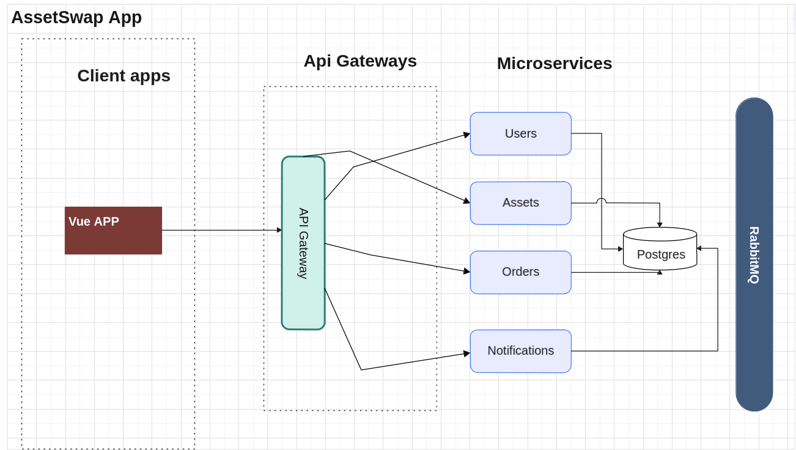

# Intro and Motivations

AssetSwap is a decentralized p2p trading platform ; that enables two "non-trusting" parties to do commerce with each other(exchange goods and services) without having to establish trust via regular advance payments or legal contracts / legal authorities. 

It specifically targets the trade of high value assets such as vehicles and real estate, where such fraud is quite common. 

Using Asset Swap the buyer and the seller can rest assured that neither party can be defrauded and either of them can choose to walk away without harming the other.

## Working 
- Buyer sends a request to Seller to enter in an engagement for trading a particular asset.
- If Seller accepts, the buyer is prompted to deposit funds.
- When buyer deposits the funds (equal to the price of the asset), an OrderManager Smart Contract is minted that now keeps track of the commercial interactions between the Buyer and Seller
- If  either party chooses to cancel the contract now, the deposited funds will be returned to buyer's  account and order will be cancelled.
- otherwise, we enter the inspection period where the buyer can inspect the asset to be bought if the seller has permitted to it; during this time, the order can't be cancelled. This inspection period is imp in trade of real estate and vehicles and can be weeks long
- buyer then completes the inspection period.
- now if the either party cancels, the funds are returned back to their address and order cancelled 
- if buyer confirms the order and seller cancels, then the same happens as above.
- it is only when both parties confirm the order that the transfer of funds (from Order Manager contract to seller's address) occurs and an NFT of the asset is minted and stored  on IPFS and added to the buyer's metamask as a token of ownership.

This way it is almost impossible to fraud the other party via the use of a Smart Contract that manages their Trade.

[View on Eraser](https://app.eraser.io/workspace/jNBfbFGSLLYzHIYSptmA?elements=Sl4CKY60JY0UbmjFMULJrQ)

# Tech Stack used

## Architecture

- Microservices ; Event Based; shared DB architecture
- RabbitMQ for microservices comms

## Tools

- NestJS as Backend Framework
- HTTP REST Apis
- DB:
  - Postgres
  - ORMS:
    - TypeORM
- Jest for unit testing

## Blockchain

- Foundry for smart contract dev and testing
- anvil as local blockchain node
- MetaMask as web3 wallet
- Storing NFT tokens of assets on IPFS nodes
  - nft.storage service used

## Cloud and DevOPS

- AWS S3 bucket for storing static data
- Docker for containerizing each microservice
- Deploying these images to AWS ECR private container registry
- AWS ECS to orchestrate a cluster of these docker images
- CI / CD:
  - AWS Codepipline to create ci / cd

## Front End

- VueJS
- Vuetify as design framework
- Figma for creating ui ux designs

# Future
- Use of **Oracle Networks**(if available in Pakistan) to add more security
- Use of **Liquidity provider** services to onboard laymen (ppl who dont own or have never worked with crypto) so that they can trade in PKR whilst blockchain runs in the backend
